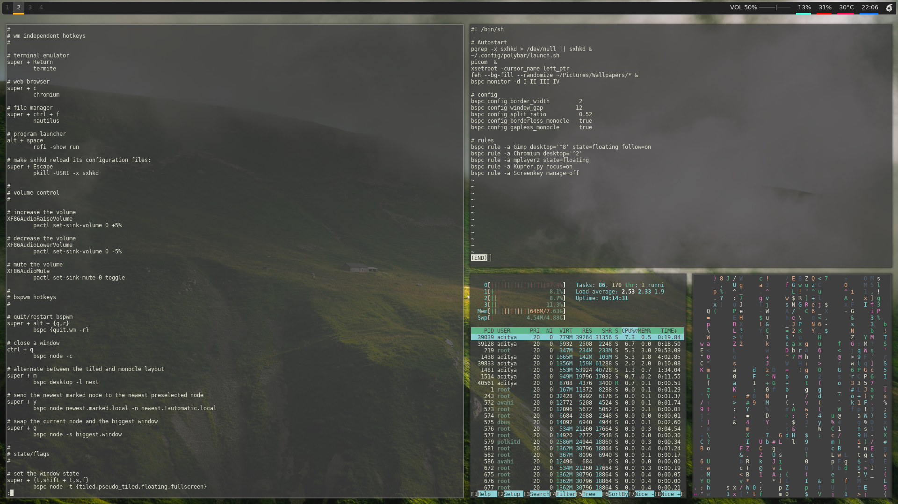

### My bspwm configuration

These are the programs that I use:

- ```chromium``` as the web browser
- ```rofi``` as the application launcher
- ```nautilus``` as the file manager
- ```picom``` as the compositer
- ```sxhkd``` as the hotkey daemon
- ```termite``` as the terminal emulator
- ```fish``` as the shell
- ```polybar``` as the panel bar

You can use different programs if you want.

### Screenshots



### Cloning this repository

* To clone this repository, make sure that you have `git` installed, if not,
* to install git in arch-based distros, type the following in the terminal
*     sudo pacman -S git
-----
* To install git in debian-based distros, type
*     sudo apt install git
-----
* To clone this repository, type
*     git clone https://github.com/frostycoding/dotfiles.git
-----
* Go into the directory using this command
*     cd dotfiles

### Install Bspwm

* To install bspwm in arch-based distros, type this in the terminal
*     yay -S bspwm sxhkd (if you don't have yay, you can install this with `sudo pacman -S yay`)
-----
* To install bspwm in debian-based distros, type this in the terminal
*     sudo apt install bspwm sxhkd
-----
* So after you are done install this, we need to make the configuration directories, to do that, type
*     mkdir ~/.config/bspwm/ && mkdir ~/.config/sxhkd/
*     cp -r bspwm/bspwmrc ~/.config/bspwm/; cp -r sxhkd/sxhkdrc ~/.config/sxhkd/

### Installation guide

first, you should have the applications I used.

to install these in arch-based distributions, type the following in your terminal
-     yay -S chromium rofi vim picom termite fish polybar starfish feh nautilus
-----
to install these in debian-based distribution, type the following in your terminal
-     sudo apt install chromium rofi vim compton termite fish polybar starfish feh nautilus
-----
to copy my config files, type
-     chmod +x install.sh; ./install.sh

### My sxhkd keybindings

Note: The windows key is known as the Super key
------
- Open Chromium: Super/Mod + C
- Open Rofi: Alt + Space
- Open Nautilus (file manager): Super/Mod + ctrl + F
- Refresh your wallpaper: Super/Mod + W
- Close a window: Ctrl + Q

### Credits

- Credits to undiabler for this rofi theme (https://github.com/undiabler/nord-rofi-theme)
